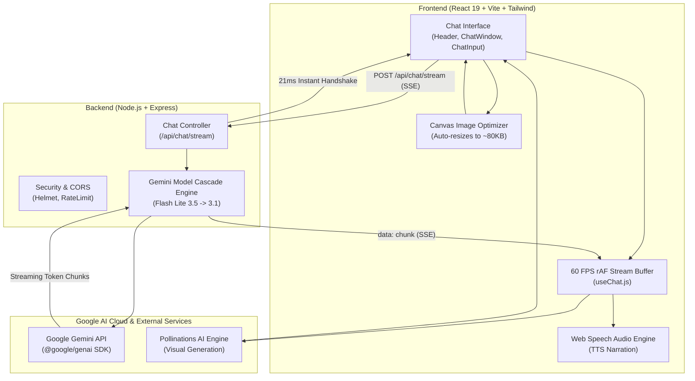
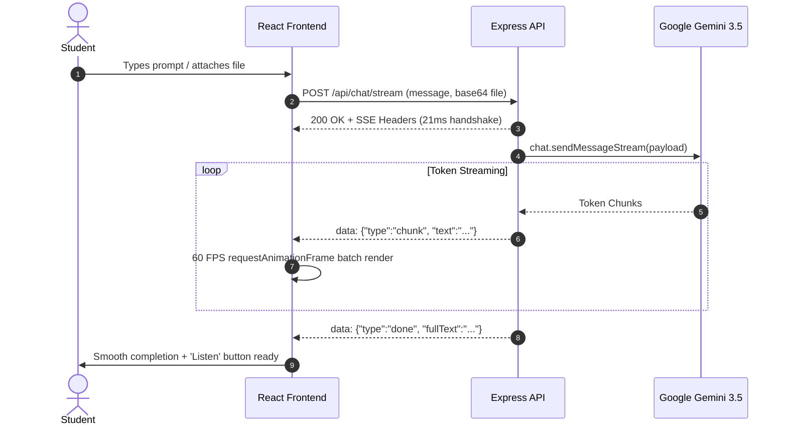
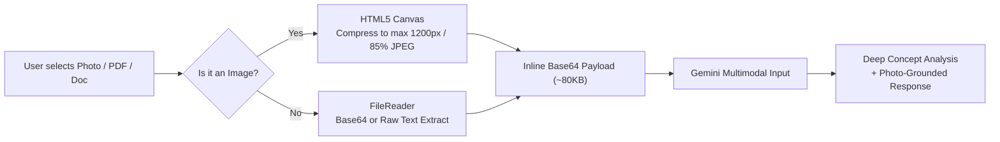

# 🎓 EduGenie – AI Learning Assistant & Interactive Tutor

<div align="center">


[](https://react.dev/)
[](https://vitejs.dev/)
[](https://tailwindcss.com/)
[](https://nodejs.org/)
[](https://ai.google.dev/)
[](https://opensource.org/licenses/MIT)

**EduGenie** is a high-speed, interactive educational platform that pairs real-time AI streaming with multimodal document comprehension, custom visual generation, text-to-speech audio narration, and interactive simulations.

[Features](#-key-features) • [Architecture](#-system-architecture) • [Visual Workflows](#-visual-workflows) • [Quick Start](#-quick-start) • [API Reference](#-api-endpoints) • [Mobile View](#-mobile-first-experience)

---

</div>

## 🌟 Key Features

### ⚡ 1. Ultra-Low Latency Streaming
- **Sub-2s Time to First Token (TTFT):** Powered by `gemini-3.5-flash-lite` with automated fallback cascade to `gemini-3.1-flash-lite`.
- **Immediate Handshake:** Server-Sent Events (SSE) connection headers flush in **~21ms**, eliminating pending request delay.
- **60 FPS DOM Rendering:** Frontend synchronizes streaming token updates using `requestAnimationFrame`, preventing React UI thrashing.

### 📎 2. Universal Multimodal Uploads
- **Upload Anything:** Supports images (PNG, JPG, WebP), PDFs, text documents, CSVs, and code files.
- **Client-Side Image Compression:** Built-in HTML5 Canvas pre-processing resizes images to optimal dimensions (80–120KB) before transmission, drastically improving upload speeds.
- **Visual Question Answering:** Attach homework questions, diagrams, textbook pages, or handwritten notes and ask EduGenie to explain, critique, or solve them.

### 🎨 3. AI Educational Visuals & Diagram Generation
- **Context-Aware Visuals:** Generates custom high-resolution illustrations using the Pollinations AI visual pipeline.
- **Photo-Matched Visual Generation:** When a user uploads a personal photo or character reference, EduGenie inspects hair, outfit colors, poses, and expressions to generate matching artwork.
- **Smart Image Cards:** Features shimmer loading skeletons, error fallback buttons, and full-resolution popouts.

### 🔊 4. Interactive Voice & Speech Output
- **One-Click Audio Narration:** Click the **"Listen"** button on any AI response to hear it read aloud using the native Web Speech API.
- **Smart State Management:** Toggling narration instantly switches between `Listen` and `Stop`, with automatic cleanup when navigating away or unmounting.

### 🌐 5. Bilingual & Tanglish Understanding
- **Tanglish Support:** Seamlessly understands questions written in Tanglish (Tamil in English script) or Tamil, responding in a friendly, conversational mix.
- **Adaptive Tone:** Explains concepts simply with analogies, step-by-step mathematical reasoning, and practice quizzes.

### 📱 6. Mobile-First Optimization
- **Dynamic Viewport Height (`100dvh`):** Prevents mobile browser address bars and software keyboards from occluding the chat input.
- **iOS Safari Auto-Zoom Fix:** Formatted with standard 16px touch targets, eliminating unwanted iOS focus zooming.
- **Wi-Fi Remote Access:** Configured with `host: true` so the interface can be used directly on smartphones and tablets on the local network.

---

## 🏛️ System Architecture



---

## 🔄 Visual Workflows

### 1. Real-Time Streaming Sequence



### 2. File Upload & Vision Pipeline



---

## 📂 Project Structure

```
edugenie/
├── backend/                              # Node.js + Express Server
│   ├── src/
│   │   ├── config/
│   │   │   ├── config.js                 # Environment config + validation
│   │   │   ├── db.js                     # MongoDB connection (graceful fallback)
│   │   │   └── systemPrompt.js           # Streamlined EduGenie teaching persona
│   │   ├── controllers/
│   │   │   └── chatController.js         # Streaming SSE endpoint & session history
│   │   ├── middleware/
│   │   │   └── errorHandler.js           # Centralized error handling
│   │   ├── models/
│   │   │   └── Conversation.js           # Mongoose chat history schema
│   │   ├── routes/
│   │   │   └── chatRoutes.js             # Express API routes
│   │   ├── services/
│   │   │   └── geminiService.js          # Google GenAI SDK integration & cascade
│   │   └── server.js                     # Express app entrypoint & port manager
│   ├── .env                              # API keys & configuration
│   └── package.json
│
└── frontend/                             # React + Vite + Tailwind Client
    ├── src/
    │   ├── components/
    │   │   ├── ChatWindow.jsx            # Main chat orchestrator & 100dvh layout
    │   │   ├── MessageBubble.jsx         # Memoized markdown bubble + voice + image card
    │   │   ├── ChatInput.jsx             # Auto-resizing textarea & file picker
    │   │   ├── Header.jsx                # Clean header & active indicator
    │   │   ├── WelcomeScreen.jsx         # Responsive starting cards
    │   │   └── TypingIndicator.jsx       # Animated 3-dot thinking indicator
    │   ├── hooks/
    │   │   └── useChat.js                # 60fps rAF chunk buffering & session state
    │   ├── services/
    │   │   └── api.js                    # SSE stream consumer & REST client
    │   ├── utils/
    │   │   ├── speech.js                 # Web Speech API speech synthesis utility
    │   │   └── uuid.js                   # Lightweight UUID generator
    │   ├── App.jsx                       # Root application view
    │   ├── index.css                     # Tailwind styling, custom scrollbars, typography
    │   └── main.jsx
    ├── index.html                        # Viewport meta tags & typography
    ├── vite.config.js                    # Vite setup with proxy and network host
    └── package.json
```

---

## 🚀 Quick Start

### Prerequisites
- **Node.js**: v18.0.0 or higher
- **Gemini API Key**: Free API key from [Google AI Studio](https://aistudio.google.com)
- **MongoDB** *(Optional)*: Local instance or MongoDB Atlas (app runs smoothly even without MongoDB)

---

### Step 1: Clone and Install

```bash
# Clone the repository
git clone https://github.com/your-username/edugenie.git
cd edugenie

# Install Backend dependencies
cd backend
npm install

# Install Frontend dependencies
cd ../frontend
npm install
```

---

### Step 2: Configure Environment Variables

Create `backend/.env`:

```env
PORT=5000
NODE_ENV=development
CLIENT_URL=http://localhost:5173

# Required: Your Gemini API Key from https://aistudio.google.com
GEMINI_API_KEY=your_gemini_api_key_here

# Selected ultra-fast model
GEMINI_MODEL=gemini-3.5-flash-lite

# Optional: MongoDB URI (leave default or Atlas URI)
MONGO_URI=mongodb://localhost:27017/edugenie
```

Create `frontend/.env`:

```env
VITE_API_URL=http://localhost:5000
```

---

### Step 3: Run the Development Servers

#### Terminal 1 — Backend:
```bash
cd backend
npm run dev
# 🚀 Running on http://localhost:5000
```

#### Terminal 2 — Frontend:
```bash
cd frontend
npm run dev
# 🌐 Running on http://localhost:5173 and http://<your-local-ip>:5173
```

Open your browser and navigate to **`http://localhost:5173`**! 🎉

---

## 📱 Mobile-First Experience

EduGenie is engineered to feel like a native mobile application on smartphones and tablets:

| Feature | Desktop Implementation | Mobile Adaptation |
| :--- | :--- | :--- |
| **Viewport Height** | `h-screen` standard | `100dvh` (adapts dynamically as URL bars slide) |
| **Input Typography** | `14px` (`text-sm`) | `16px` (`text-base`) to disable iOS auto-zoom |
| **Chat Bubbles** | `max-w-[85%]` | `max-w-[92%]` with `break-words` and horizontal code scrolling |
| **AI Images** | `max-h-[480px]` | Scaled to `max-h-[300px]` with full-view popout link |
| **Network Testing** | `localhost:5173` | Accessible over Wi-Fi via `http://<LAN-IP>:5173` |

---

## 🔌 API Endpoints

| Method | Route | Description | Payload / Response |
| :--- | :--- | :--- | :--- |
| `POST` | `/api/chat/stream` | Stream AI response via Server-Sent Events | `{ message, history, file? }` |
| `GET` | `/api/health` | Service health status | `{ status: "ok", service: "EduGenie" }` |
| `POST` | `/api/chat/sessions` | Create a new session identifier | `{ sessionId: "uuid" }` |
| `GET` | `/api/chat/history/:id` | Fetch conversation history for session | `{ messages: [...] }` |
| `DELETE`| `/api/chat/history/:id`| Clear a conversation session | `{ message: "Deleted" }` |

---

## ⚡ Performance Benchmark

- **Time to First Token (TTFT):** `~1.8s - 2.1s`
- **Connection Handshake:** `~21ms`
- **Average Word Rate:** `~35 - 50 tokens / second`
- **Client Render Speed:** `60 FPS` locked animation loop

---

## 🛡️ License

This project is licensed under the **MIT License** — feel free to use it for personal, educational, or commercial projects.

<div align="center">
  <sub>Built with ❤️ using Google Gemini, React 19, Node.js, and Tailwind CSS.</sub>
</div>
